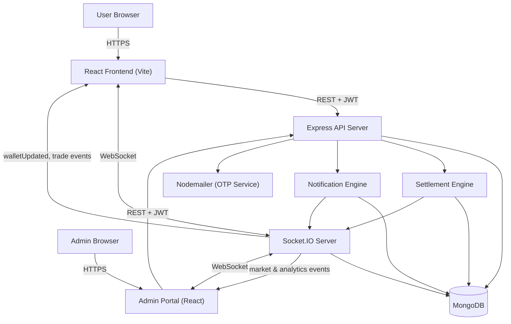
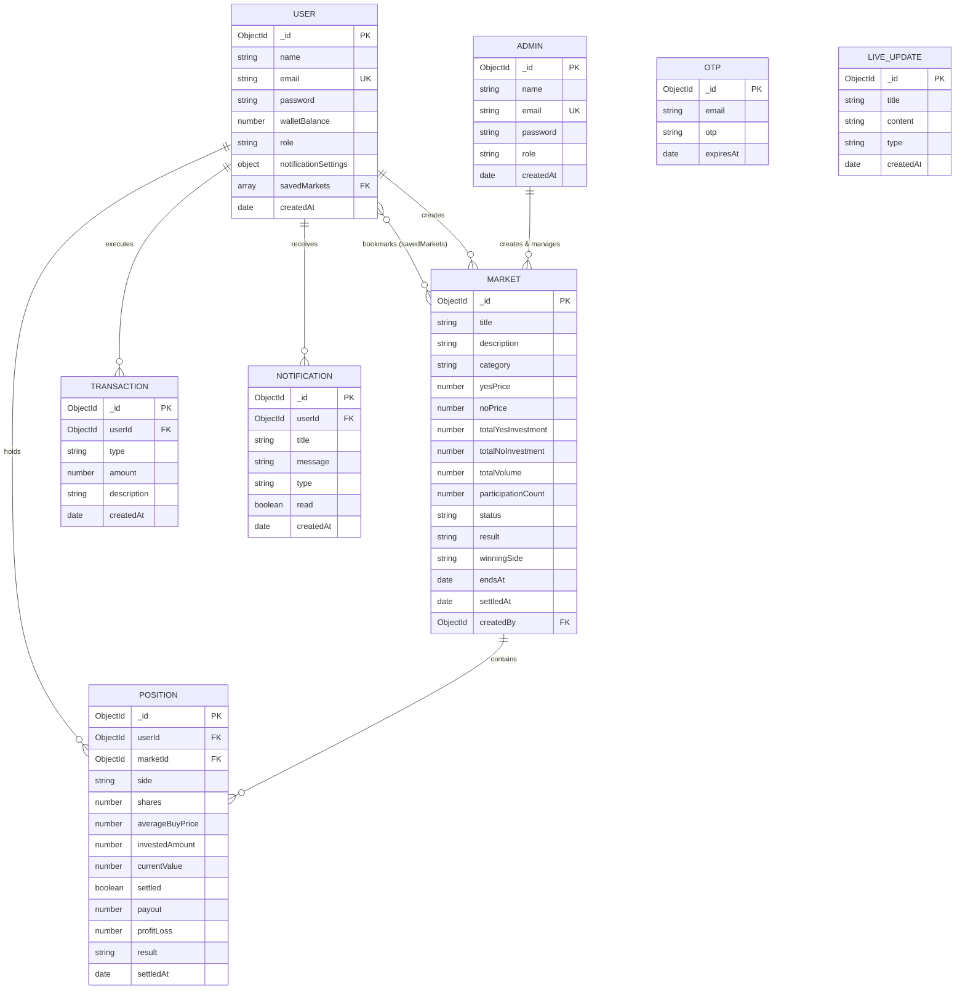

<div align="center">

# 📊 PredictX — Social Prediction Trading Platform

**Trade the future. Trend by trend.**

A full-stack, real-time prediction market where users trade YES/NO shares on trending topics — sports, creators, memes, products — with live pricing, portfolios, and leaderboards.

[](#-license)
[](#)
[](#)
[](#)
[](#)
[](#)
[](#)
[](#)

</div>

---

## Table of Contents

- [Overview](#overview)
- [Key Features](#key-features)
- [Screenshots](#screenshots)
- [Tech Stack](#tech-stack)
- [System Architecture](#system-architecture)
- [Database Design](#database-design)
- [Folder Structure](#folder-structure)
- [Installation](#installation)
- [Environment Variables](#environment-variables)
- [API Overview](#api-overview)
- [Core Workflow](#core-workflow)
- [Engineering Notes](#engineering-notes)
- [Performance](#performance)
- [Security](#security)
- [Roadmap](#roadmap)
- [License](#license)
- [Author](#author)

---

## Overview

PredictX is a real-time prediction market platform. Users buy and sell YES/NO shares on real-world events — sports outcomes, creator milestones, meme trends, product launches — and the price of each share moves with demand, the same way an order book would in a financial market.

It's built as two separate applications sharing one backend:

| App | Who it's for | What it does |
|---|---|---|
| **User app** | Traders | Browse markets, trade shares, track portfolio and wallet, climb the leaderboard |
| **Admin portal** | Operators | Create markets, monitor platform analytics, resolve outcomes and trigger payouts |

Keeping admin and trading logic in separate schemas and separate frontends was a deliberate call — it avoids the mess of trying to bolt admin permissions onto a user model that was never designed to hold them (more on that in [Engineering Notes](#engineering-notes)).

---

## Key Features

**Auth & accounts**
- Sign-up/login with input validation
- OTP email verification before an account can trade
- Route guards on both frontend (`ProtectedRoute`, `GuestRoute`) and backend

**Trading**
- Dynamic YES/NO pricing that shifts with market participation
- Quick-invest modal with preset amounts (₹100 / ₹500 / ₹1,000+)
- Live preview of shares, potential payout, and estimated ROI before confirming
- A selling marketplace to exit a position before the market closes

**Portfolio & wallet**
- Real-time P&L per position, color-coded (green for profit, red for loss)
- Position cards showing buy price, current price, quantity, and win probability
- Wallet balance synced instantly over WebSocket (`walletUpdated`)
- Full transaction ledger — `CREDIT`, `DEBIT`, `MARKET_BUY`, `MARKET_SELL`, `REWARD`

**Leaderboards**
- Top traders by net profit and volume
- Highest-liquidity markets
- Top market creators by volume generated

**Notifications**
- Live unread badge counts
- Sound and notification preferences, persisted in both the DB and `localStorage`

**Admin dashboard**
- Fully separate auth and layout from the user app
- Market lifecycle management: Open → Closed → Settled
- Settlement engine — pick a winning side, and payouts, position statuses, and market state all update in one action
- Searchable/filterable user directory
- Volume trends, category breakdowns, and market status charts (Recharts)
- Separate leaderboard for creator admins

**Real-time**
- Trade, wallet, and notification events broadcast over Socket.IO to every open session
- UI sound feedback via the Web Audio API — no audio files to load

---

## Screenshots

Drop images into `docs/screenshots/` and they'll render here.

| Home | Portfolio |
|---|---|
|  |  |

| Trading Modal | Admin Dashboard |
|---|---|
|  |  |

| Leaderboard | Wallet |
|---|---|
|  |  |

---

## Tech Stack

| Layer | Technology |
|---|---|
| Frontend | React 18 + Vite |
| Backend | Node.js + Express.js |
| Database | MongoDB + Mongoose |
| Auth | JWT + bcrypt.js |
| Realtime | Socket.IO |
| Charts | Recharts |
| Styling | TailwindCSS |
| Animation | Framer Motion |
| Icons | Lucide React |
| Audio | Web Audio API |
| HTTP client | Axios |
| Email | Nodemailer |

---

## System Architecture



---

## Database Design



---

## Folder Structure

```
predictx/
├── client/                        # React frontend (user app)
│   ├── src/
│   │   ├── components/
│   │   ├── pages/
│   │   ├── hooks/
│   │   ├── context/
│   │   ├── utils/
│   │   └── main.jsx
│   └── vite.config.js
│
├── admin/                         # React admin portal
│   ├── src/
│   │   ├── components/
│   │   ├── pages/
│   │   └── layouts/
│   └── vite.config.js
│
├── server/                        # Express backend
│   ├── models/
│   │   ├── User.js
│   │   ├── Admin.js
│   │   ├── Market.js
│   │   ├── Position.js
│   │   ├── Transaction.js
│   │   ├── Notification.js
│   │   ├── OTP.js
│   │   └── LiveUpdate.js
│   ├── routes/
│   ├── controllers/
│   ├── middleware/
│   ├── sockets/
│   └── server.js
│
├── docs/
│   └── screenshots/
│
├── .env.example
└── README.md
```

---

## Installation

Clone the repo:
```bash
git clone https://github.com/<your-username>/predictx.git
cd predictx
```

Install the frontend:
```bash
cd client
npm install
```

Install the backend:
```bash
cd ../server
npm install
```

Set up environment variables — copy `.env.example` in `/server` and fill in the values from the [table below](#environment-variables).

Run the backend:
```bash
cd server
npm run dev
```

Run the frontend, in a separate terminal:
```bash
cd client
npm run dev
```

The frontend will connect to the API and Socket.IO server automatically once both are running.

---

## Environment Variables

Set these in `/server/.env`:

| Variable | Description |
|---|---|
| `PORT` | Port for the Express server |
| `MONGO_URI` | MongoDB connection string |
| `JWT_SECRET` | Secret key for signing JWT tokens |
| `JWT_EXPIRES_IN` | Token expiry duration |
| `EMAIL_HOST` | SMTP host for Nodemailer |
| `EMAIL_PORT` | SMTP port |
| `EMAIL_USER` | SMTP account username |
| `EMAIL_PASS` | SMTP account password |
| `CLIENT_URL` | Frontend origin (CORS) |
| `ADMIN_URL` | Admin portal origin (CORS) |

---

## API Overview

The major endpoints — not a full reference.

| Method | Endpoint | Description |
|---|---|---|
| `POST` | `/api/auth/register` | Register a user, send OTP |
| `POST` | `/api/auth/verify-otp` | Verify OTP, activate account |
| `POST` | `/api/auth/login` | Authenticate, issue JWT |
| `GET` | `/api/markets` | List all markets |
| `POST` | `/api/markets` | Create a market (admin) |
| `POST` | `/api/markets/:id/settle` | Declare winner, trigger settlement (admin) |
| `POST` | `/api/positions/buy` | Buy YES/NO shares |
| `POST` | `/api/positions/sell` | Sell an open position |
| `GET` | `/api/wallet` | Get wallet balance and ledger |
| `GET` | `/api/leaderboard` | Get trader/creator rankings |
| `GET` | `/api/notifications` | Get user notifications |

---

## Core Workflow

1. **Register** — user signs up
2. **Verify** — OTP sent via Nodemailer; account activates on success
3. **Trade**
   - *Buy* — pick YES or NO, preview shares/payout/ROI, confirm
   - *Sell* — exit an open position through the selling marketplace before the market closes
4. **Settle** — admin declares the winning side; the settlement engine resolves every position tied to that market
5. **Update wallet** — payouts and balance changes go out instantly over `walletUpdated`
6. **Update leaderboard** — rankings recalculate from net profit and volume
7. **Notify** — affected users get a real-time notification for trades, settlement, and system events

---

## Engineering Notes

A few decisions worth calling out beyond the feature list:

- **Users and admins are separate schemas, not one model with a role flag.** Admin accounts don't carry wallet or trade fields at all — they're operators, not participants, and the schema reflects that instead of leaving a pile of unused fields on every admin document.
- **Everything that changes state pushes over WebSocket rather than waiting to be polled.** Wallet balances, trade fills, and notifications reach every open tab the moment they happen on the server.
- **Settlement is one action, not a checklist.** When an admin picks a winning side, payouts, position statuses, and the market's own state all update together instead of requiring separate manual steps.
- **Every wallet change is logged, not just applied.** The `Transaction` collection means a user's balance is always explainable after the fact, not just a number that changed.
- **UI sound effects are generated with the Web Audio API instead of shipped as files** — one less asset to load, and no extra network requests for something this small.
- **Notification and sound preferences are stored in both `localStorage` and the database**, so a returning user's settings are already correct before the API call even finishes.

---

## Performance

- Vite for fast local builds and a lean production bundle
- WebSocket push instead of polling, which cuts unnecessary API traffic
- Indexed, validated Mongoose schemas to keep queries and writes fast
- Native Web Audio API for sound — nothing to download
- Shared Axios instance with interceptors, so JWT headers aren't reattached by hand on every request

---

## Security

- JWT-based sessions, stateless by design
- Passwords hashed with bcrypt.js — never stored in plaintext
- Route guards on both frontend (`ProtectedRoute`, `GuestRoute`) and backend
- Admin-only middleware on every administrative endpoint
- OTP email verification required before an account can trade
- Input validation on auth and trading flows

---

## Roadmap

- [ ] OpenAPI/Swagger docs for the public API
- [ ] Multi-currency wallet support
- [ ] Push notifications (web and mobile)
- [ ] Comments and discussion threads on markets
- [ ] Candlestick-style price history per market
- [ ] Automated market-making for thinner markets
- [ ] React Native mobile app

---

## License

MIT — see [LICENSE](LICENSE).

---

## Author

**Vertika Singh and Sneha**

-[https://github.com/vertika13122007-tech](#)

-[https://github.com/Sneha2536](#)


---
